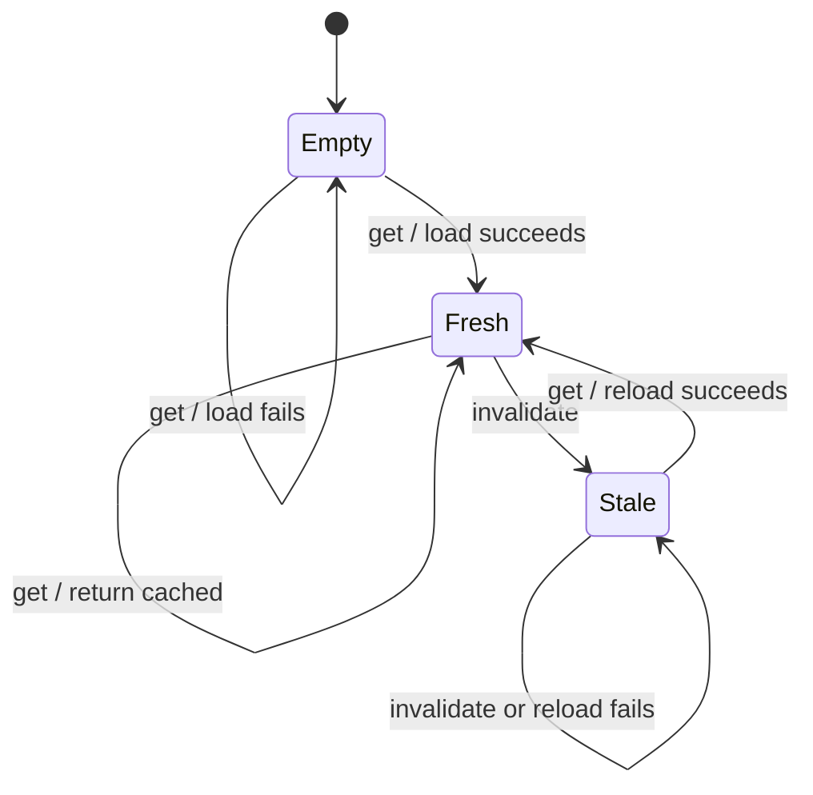
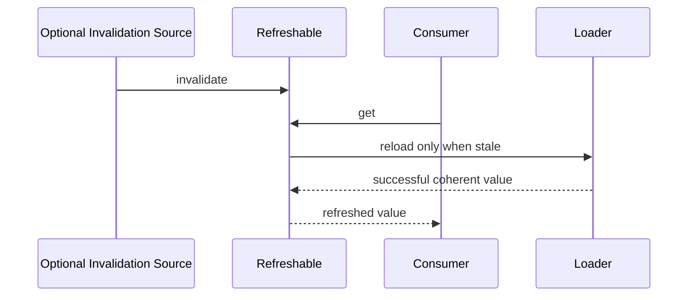
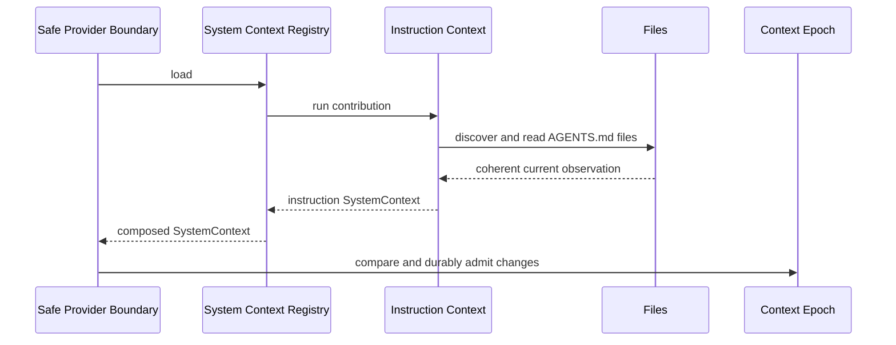
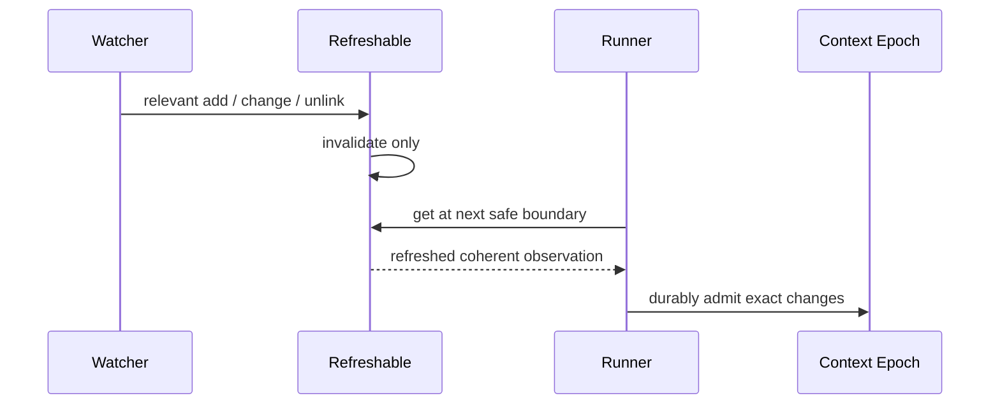

# Refreshable Context Sources

## Status

Reviewed proposal for ambient `AGENTS.md`, configured instruction paths or URLs, and later local skill-source invalidation.

## Decision Summary

Context-source observation remains pull-based and lazy at a safe provider-turn boundary.

```text
source signal
-> mark an optional observation cache stale
-> next naturally scheduled safe provider-turn boundary observes current state
-> Context Epoch compares and admits exact changed bytes durably
```

The first ambient `AGENTS.md` slice will not depend on filesystem watching. Its scoped contributor will directly observe local instruction state whenever `SystemContextRegistry.load()` naturally runs before a provider turn.

Watcher-backed caches are a later efficiency optimization for roots with proven subscription coverage. URLs remain separate observations with an independently chosen refresh policy.

## Existing Pieces

| Existing piece                      | Responsibility                                                                                                                 |
| ----------------------------------- | ------------------------------------------------------------------------------------------------------------------------------ |
| `Watcher.locationLayer`             | Publish advisory `file.watcher.updated` events for local filesystem changes.                                                   |
| `EventV2.subscribe(...)`            | Expose advisory events as scoped Effect streams.                                                                               |
| `State.create(...)`                 | Rebuild replayable plugin and config contribution state from scoped transforms.                                                |
| `SynchronizedRef.modifyEffect(...)` | Serialize effectful state refresh and store the next value only after success.                                                 |
| `SystemContext`                     | Convert coherent source samples into one immutable baseline, chronological updates, unavailable state, and removal tombstones. |
| `SystemContextRegistry`             | Assemble Location-scoped built-in, instruction, and plugin context producers in stable contribution-key order.                 |
| `LocationServiceMap`                | Own and clean up Location-scoped services, watcher subscriptions, and observation caches together.                             |

The missing reusable piece is deliberately small: retain the last successful value, mark it stale, and serialize refresh attempts.

## Primitive: `Refreshable`

Place the optional coordination helper at:

```text
packages/core/src/effect/refreshable.ts
```

`Refreshable` does not know about files, URLs, timers, watchers, Sessions, Context Epochs, or stale fallbacks. Domain services decide when to use it and how to recover expected observation failures.

```ts
export interface Refreshable<A, E = never, R = never> {
  readonly get: Effect.Effect<A, E, R>
  readonly invalidate: Effect.Effect<void>
}

export const make = <A, E, R>(
  load: Effect.Effect<A, E, R>,
): Effect.Effect<Refreshable<A, E, R>>
```

Internal state:

```ts
type State<A> =
  | { readonly _tag: "Empty" }
  | { readonly _tag: "Fresh"; readonly value: A }
  | { readonly _tag: "Stale"; readonly value: A }
```

Implementation substrate:

```text
SynchronizedRef.modifyEffect(...)
```

Semantics:

| Operation                          | Behavior                                                                                                   |
| ---------------------------------- | ---------------------------------------------------------------------------------------------------------- |
| `get` on `Empty`                   | Run `load`, store `Fresh(value)` only after success, and return it.                                        |
| `get` on `Fresh(value)`            | Return the cached value without I/O.                                                                       |
| `get` on `Stale(previous)`         | Run `load`, store `Fresh(value)` only after success, and return it.                                        |
| `invalidate` on `Fresh(value)`     | Store `Stale(value)`.                                                                                      |
| `invalidate` on `Empty` or `Stale` | No-op. Repeated invalidations coalesce.                                                                    |
| failed `load`                      | Preserve the prior `Empty` or `Stale(previous)` state, propagate the failure, and retry on the next `get`. |
| invalidation during `load`         | Serialize after the reload and leave the refreshed cache stale for the next `get`.                         |



### Why Custom Instead Of Existing Effect Caches

Effect `Cache`, `ScopedCache`, and `Effect.cachedInvalidateWithTTL(...)` cache failed exits. Effect `Resource` preserves its prior value after a failed refresh, but eagerly acquires and does not reload lazily after explicit invalidation. Context-source observation requires the narrower lazy `Empty` / `Fresh` / `Stale` rule:

```text
failed refresh
-> retain prior successful value internally
-> remain stale
-> retry at the next natural request
```

`SynchronizedRef.modifyEffect(...)` commits the next state only after the refresh effect succeeds.

### Why No `peek`

`Refreshable` should not expose stale fallback reads. A domain service that needs a previous discovery graph during failed rescans should own that graph explicitly in its observation model.

### Why No Refresh Modes Or TTL

An always-refreshed source does not need a cache: load it directly. TTL expiry, watcher events, and explicit source changes are external invalidation policies that may call `invalidate` later.



## Observation Units

Compose refreshables around coherent observations that share one invalidation policy. Do not create one uniformly per rendered Context Source or one aggregate cache for unrelated source kinds.

```text
local built-in discovery
-> one coherent observation while it shares one refresh policy

configured local glob
-> separate observation when its scan root or coverage differs

configured URL
-> independent observation

local skill directory
-> naturally one observation per registered source

embedded skill
-> direct value, no refreshable
```

## Ambient Instruction Contributor

Add a Location-scoped contributor to `SystemContextRegistry`:

```ts
yield *
  registry.contribute({
    key: SystemContext.Key.make("core/instructions"),
    load: loadAmbientInstructions(),
  })
```

`InstructionContext` owns instruction discovery, deterministic ordering, and source loading. `SystemContextRegistry` owns contributor composition and lifecycle. `SystemContext` remains unaware of files and URLs.

The first slice closes one coherent ordered instruction set into an aggregate source:

```text
core/instructions
-> [{ path, content }, ...]
```

Rendered text retains the human-readable source identity:

```text
Instructions from: /repo/packages/core/AGENTS.md
<exact file contents>
```

or:

```text
Instructions from: https://example.com/shared-agents.md
<exact response body>
```

The first implementation directly observes global and upward project `AGENTS.md` files on every safe provider-turn boundary. It does not use `Refreshable` yet unless a coherent source observation needs stale-on-failure retention.



## Source Outcomes

Discovery and file reads form one coherent aggregate observation in the first slice.

```text
successful discovery and reads
-> one ordered aggregate instruction value

temporary discovery or read failure
-> aggregate SystemContext.unavailable
```

| Observation                                                    | Source outcome                                                                                   |
| -------------------------------------------------------------- | ------------------------------------------------------------------------------------------------ |
| Local scan succeeds and discovers readable file                | Include its exact contents in the available aggregate source.                                    |
| Local scan succeeds and a previously discovered file is absent | Remove it from the aggregate value; remove the aggregate source when no instructions remain.     |
| Local scan or file read fails transiently                      | Preserve the admitted aggregate source as `SystemContext.unavailable`; never emit mass removals. |
| Empty local file                                               | Include the empty exact content in the available aggregate source.                               |
| URL returns `2xx` body                                         | Available source with exact contents.                                                            |
| URL times out or returns transient failure                     | `SystemContext.unavailable`.                                                                     |
| URL returns `404` or `410`                                     | Decide the explicit removal contract before URL implementation.                                  |

Aggregate instruction removal text must be model-meaningful:

```text
Previously loaded instructions no longer apply.
```

## First Ambient Slice

Implement only:

```text
global config AGENTS.md
+ upward project AGENTS.md ancestors
+ one aggregate core/instructions source
+ direct safe-turn observation
```

Preserve V1 ancestor stacking for `AGENTS.md`: nearest ancestor first, then outward through the project boundary.

Do not include yet:

```text
CLAUDE.md compatibility fallback
deprecated CONTEXT.md fallback
configured local paths or globs
configured URLs
watcher-backed caching
skills migration
nested read-triggered discovery
```

Tests:

```text
initial baseline
edit
newly added ancestor AGENTS.md
confirmed unlink with meaningful removal text
empty file
transient scan failure
transient file-read failure
deterministic ordering
restart with durable structured snapshots
```

## Future Watcher Optimization

Watchers remain advisory optimizations. They never wake idle Sessions and never publish durable Session context events.

The current watcher subscribes only to `location.directory`, has ignore rules, starts asynchronously, and swallows subscription failures. Effective source roots may live elsewhere. Do not expose one broad `Watcher.Service.local: "watching" | "poll"` flag.

Add root-specific watching only when needed:

```ts
export interface Watcher.Interface {
  readonly watch: (root: AbsolutePath) => Effect.Effect<"watching" | "poll">
}
```

The exact watcher API remains a follow-up design. A truthful contract must account for:

- successful subscription startup;
- subscription failure and callback error;
- source roots above or outside `location.directory`;
- ignore and protected-path coverage;
- scope cleanup;
- own-process mutations that should synchronously invalidate caches before the next continuation turn.

When root coverage is proven:



If coverage is not proven, bypass the cache and observe directly whenever the safe boundary naturally requests current state. This is safe-turn refresh, not a background polling loop.

When coverage is proven, cache each known candidate instruction path independently rather than invalidating one aggregate instruction cache:

```text
candidate instruction path
-> one Refreshable<File | Absent>
-> watcher event invalidates only the matching path
-> next safe provider boundary reloads only stale candidates
-> available candidates become ordered per-file Context Sources
```

Ambient candidates include the global `AGENTS.md` path and one `AGENTS.md` candidate in every applicable ancestor directory, including candidates that are currently absent so later additions are observable.

## URL Sources

URLs never share an observation cache with local discovery.

Start with direct safe-turn loading:

```text
safe provider-turn boundary
-> fetch URL
-> emit available or unavailable source
```

If measurements show excessive requests, add a URL-specific invalidation policy later:

```text
TTL expires
-> invalidate URL Refreshable
-> next safe provider-turn boundary reloads URL
```

A TTL timer must not wake idle Sessions or publish durable Session events.

## Skills Reuse

`SkillV2` currently stores replayable source registrations through `State.create(...)` and materialized source results in a raw permanent `Map<string, Info[]>`.

Use `Refreshable` later for local directory sources only after skill observation distinguishes confirmed absence from transient failure:

```text
State.create
-> current replayable Source registrations

private Map<Source.key, Refreshable>
-> reconcile against active non-embedded source keys
-> create refreshable for added source
-> drop refreshable for removed source
```

Do not add a generic `State -> cache invalidation` bridge. The skill service owns both current registrations and its observation-cache lifecycle.

Remote skill refresh remains a separate design slice because the current puller skips files that already exist and therefore does not define overwrite or removal semantics.

## Nested Instruction Discovery

Nested instructions discovered after successful read-tool activity remain a Session-scoped follow-up.

- The Location-scoped instruction service may resolve and reuse source observations.
- The set of nested source identities active for one Session must be durable and Session-scoped.
- Successful local file reads record newly observed nested source identities through synchronized Session events.
- The next safe provider boundary loads and admits them through Context Epoch history.
- Do not inject V1-style reminder text directly into read-tool output.
- Do not activate nested discovery for directory reads, managed tool-output resources, or external references until those semantics are explicitly designed.

## Lifecycle

- Location scope owns the System Context Registry, scoped context contributions, optional watcher-consumer fibers, and refreshable state.
- `Effect.forkScoped(...)` interrupts watcher-consumer fibers when the cached Location runtime is disposed.
- Stream finalization unsubscribes `EventV2` PubSub subscriptions.
- `Watcher.locationLayer` separately finalizes native Parcel watcher subscriptions.
- Repeated invalidations coalesce into one `Stale` state.
- Idle Sessions are not woken by local edits, URL timers, or plugin changes.
- Context Epoch admission remains serialized by the Session event transaction at the next naturally scheduled provider turn.

## Implementation Status And Follow-Up Order

Implemented in the direct-observation slice:

1. Add the Location-scoped `SystemContextRegistry` backed by stable-keyed scoped contributions.
2. Register built-in and ambient instruction producers with `SystemContextRegistry`.
3. Observe local instructions directly at each safe provider boundary.
4. Preserve admitted instructions after transient scan/read failure and block initial provider turns while context is unavailable.
5. Test ordering, edit, unlink, empty file, transient scan failure, discovered-then-missing races, durable restart behavior, and deterministic context admission.

Follow-up order:

1. Add and unit-test `Refreshable.make(load)` with `get` and `invalidate`.
2. Add truthful root-specific watcher registration.
3. Move ambient instructions from one directly observed aggregate to one watcher-invalidated Refreshable and Context Source per candidate file.
4. Add configured local exact paths and globs.
5. Add configured URL observations with explicit `404` and `410` semantics.
6. Migrate local `SkillV2` directory observations to per-source refreshables after skill failure semantics are corrected.
7. Add durable Session-scoped nested read discovery.

## Open Questions

1. Should configured URL sources treat `404` and `410` as confirmed removals?
2. What root-specific watcher API cleanly models ignore policy and callback health?
3. Should own-process file mutations publish an advisory invalidation event synchronously after commit?

## Compression Line

```text
SystemContextRegistry remembers which context producers participate.
Refreshable remembers whether a successful observation needs loading again.
Context Epoch remembers what the model was told.
```
